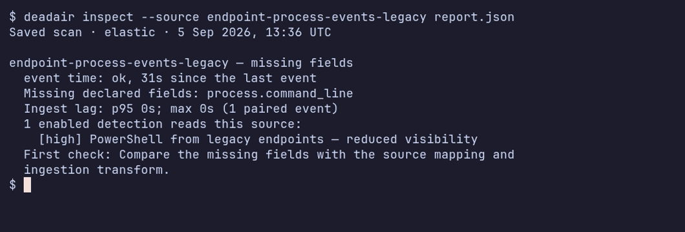
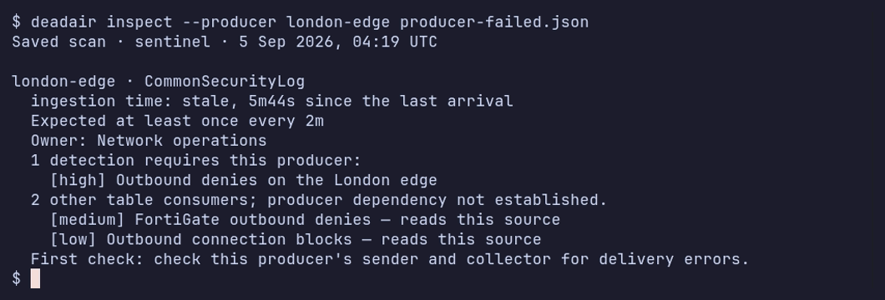

<p align="center">
  <picture>
    <source media="(prefers-color-scheme: dark)" srcset="docs/assets/banner-dark.svg">
    
  </picture>
</p>

<p align="center">
  <a href="https://github.com/alephnull-sh/deadair/actions/workflows/ci.yml"></a>
  <a href="https://github.com/alephnull-sh/deadair/releases"></a>
  
  <a href="LICENSE"></a>
</p>

<p align="center">
  <strong>deadair checks whether enabled SIEM detections still have the telemetry they need.</strong><br>
  It reports missing or stale data, ingest delays, and schema mismatches.
</p>

<p align="center">
  Runs locally · Read-only · No agent · No telemetry upload
</p>

<p align="center">
  <a href="https://alephnull-sh.github.io/deadair/">Read the technical write-up</a> ·
  <a href="https://www.detectionengineering.net/i/208193682/detection-engineering-gem">Featured in Detection Engineering Weekly</a> ·
  <a href="https://tldrsec.com/p/tldr-sec-341">Featured in tl;dr sec #341</a>
</p>

<p align="center">
  <a href="https://alephnull-sh.github.io/deadair/#elastic-demo"></a>
</p>

<p align="center">
  <sub>Missing fields and delayed events in a disposable Elastic lab. Open the image for the short recording with playback controls, or reproduce it with <code>make record-scan-lab</code>.</sub>
</p>

## Why deadair

A rule can be enabled, scheduled, and error-free after the data it needs has disappeared. deadair
reads the live rule inventory, resolves each rule's inputs using the backend's native semantics, and
checks the concrete sources behind them.

It catches:

- rules whose index, alias, or data-stream selectors resolve to nothing;
- mixed-selector rules where one declared input has disappeared while another still resolves;
- rules whose matching sources are all stale or empty;
- on Elastic, rules running with missing declared fields;
- on Elastic and eligible Sentinel Scheduled rules, an ingest-lag blind window;
- on Sentinel, rules whose known sources use an incompatible Basic or Auxiliary table plan;
- on Elastic and OpenSearch, healthy telemetry that no enabled detection reads.

deadair supports Elastic Security, OpenSearch Security Analytics, and Microsoft Sentinel.

## Quick start

Download a binary for macOS, Linux, or Windows from
[GitHub Releases](https://github.com/alephnull-sh/deadair/releases), or install with Go:

```sh
go install github.com/alephnull-sh/deadair/cmd/deadair@latest
```

Print the read-only setup for your SIEM:

```sh
deadair setup elastic      # Elastic Security
deadair setup opensearch   # OpenSearch Security Analytics
deadair setup sentinel     # Microsoft Sentinel
```

Run one setup, then verify and scan:

```sh
deadair check   # verify the credential can scan
deadair scan    # assess live rules and telemetry
```

Exit codes are stable: `0` passes the configured gate, `1` means gated findings, and `2` means the scan failed.

To investigate a source and its consuming detections:

```sh
deadair scan --json-out report.json --html-out report.html
deadair inspect --source CommonSecurityLog report.json
```

Use a source name from your report. The [investigation guide](docs/investigate.md) also covers
individual Sentinel feeds, maintenance, and recovery tracking.

## How it works

| Stage | What deadair does |
|---|---|
| Inventory | reads enabled detections and the inputs they declare |
| Resolve | uses native index resolution on Elastic and OpenSearch; on Sentinel, combines KQL analysis with table, watchlist, saved-function, ASIM, and mapped cross-workspace evidence |
| Measure | checks source freshness and timing, plus schema and storage where the backend supports them |
| Report | emits terminal, JSON, HTML, fleet rollups, and Prometheus metrics with the evidence behind each verdict |

Sentinel follows the same rule-to-source model and adds literal watchlists, saved functions, ASIM
parsers, mapped workspaces, and summary-table lineage. It also shows when a filtered slice of a
shared table has gone quiet or a summary pipeline has fallen behind.

The [usage guide](docs/usage.md#microsoft-sentinel) describes the evidence rules, and the
[validation record](docs/validation.md#sentinel-live-conformance) records the live test coverage.

<p align="center">
  <a href="https://alephnull-sh.github.io/deadair/#sentinel-demo"></a>
</p>

<p align="center">
  <sub>Two firewall feeds share <code>CommonSecurityLog</code>. One stops; the other keeps reporting. The recording shows the saved failure and recovery scans. See the <a href="docs/validation.md#sentinel-live-conformance">validation record</a> for the lab conditions.</sub>
</p>

deadair checks whether a detection's telemetry is present and healthy. It does not validate rule
logic or prove that a simulated attack will fire an alert. Use static rule validation and end-to-end
detection tests for those jobs.

## Findings

| Finding | Meaning | First check |
|---|---|---|
| no matching source | none of the rule's inputs resolve to a visible index, data stream, or Sentinel table | pattern changes, missing integrations, and credential scope |
| all sources stale or empty | every resolved source is unusable right now | source cadence and the ingest path |
| missing fields | an Elastic rule-declared field is absent or non-searchable in one or more resolved sources after every source mapping was read | parser, package, and mapping changes |
| lag blind window | paired-event p95 ingest lag exceeds the rule's lookback margin | rule interval, lookback, timestamp override, and pipeline delay |
| partial input coverage | the complete expression resolves, but one positive selector within it resolves empty | migrations, fallback selectors, and expected alternatives; informational unless policy gates it |
| source plan incompatible | a Sentinel rule depends on a Basic or Auxiliary table that is not eligible for the analytics-rule evidence path | table plan and rule type |
| source degradation | a source is stale, empty, low-volume, or schema-drifted | source history and expected maintenance |
| unused telemetry | on Elastic or OpenSearch, data is being stored but no enabled local detection resolves to it | disabled rules and intentional collection |
| expected producer quiet | a configured Sentinel vendor, product, or device feed hasn't reported within its threshold | that feed's sender and collector |
| summary pipeline unhealthy | a relevant Sentinel summary job failed or its last success is overdue | the native execution record and summary query |

Producer and summary-pipeline findings affect exit status when their classes are selected in the
policy. A quiet device feed is reported separately from other consumers of its shared table.

Every verdict is limited to what the configured credential can see. JSON reports include the
configured expressions, resolved sources, resolution method, assessment status, backend metadata,
and capability evidence. See the [usage guide](docs/usage.md) for worked examples and triage.

## Connect a SIEM

Elastic:

```sh
export DEADAIR_ES_URL=https://es.example.internal:9200
export DEADAIR_KIBANA_URL=https://kibana.example.internal:5601
export DEADAIR_API_KEY=<read-only-api-key>

deadair check
deadair scan --json-out report.json --html-out report.html
```

OpenSearch:

```sh
export DEADAIR_BACKEND=opensearch
export DEADAIR_OPENSEARCH_URL=https://opensearch.example.internal:9200
export DEADAIR_OPENSEARCH_USERNAME=deadair
export DEADAIR_OPENSEARCH_PASSWORD=<password>

deadair check
deadair scan
```

Microsoft Sentinel:

```sh
az login --tenant <tenant-id>

export DEADAIR_BACKEND=sentinel
export DEADAIR_AZURE_SUBSCRIPTION_ID=<subscription-id>
export DEADAIR_AZURE_RESOURCE_GROUP=<resource-group>
export DEADAIR_SENTINEL_WORKSPACE=<workspace-resource-name>
# Optional: JSON allowlist for literal workspace() targets.
# export DEADAIR_SENTINEL_REMOTES=/restricted/path/sentinel-remotes.json

deadair check
deadair scan
```

Before deadair assesses a rule's mapped remote workspace, that workspace must have Sentinel
deployed. Same-subscription mappings can prove source availability. Cross-subscription rules need
runtime evidence tied to the exact rule identity. See the
[Sentinel usage details](docs/usage.md#microsoft-sentinel) for the evidence rules, workspace and
region limits, and Microsoft's performance guidance.

Use the documented read-only roles for
[Elastic](docs/credentials/elastic.md), [OpenSearch](docs/credentials/opensearch.md), or
[Microsoft Sentinel](docs/credentials/sentinel.md).

## CI, fleets, and monitoring

```sh
# Gate a candidate rule against live source availability.
deadair scan --rule new-rule.json

# Fail only on new regressions between reports.
deadair diff yesterday.json today.json

# Scan multiple SIEM instances from one process.
deadair scan --fleet fleet.json

# Export cached scan results as Prometheus metrics.
deadair serve --interval 5m
```

`scan --rule` isolates a backend-native candidate rule or detector from unrelated backlog. `diff`
works with redacted reports created with the same caller-held key. Fleet configuration references
secrets through environment variables rather than storing secret values.

The [official GitHub Action](docs/usage.md#gate-detection-changes) wraps single-instance candidate
gates for Elastic, OpenSearch, and Sentinel. It writes a job summary, uploads a redacted JSON
report, and can apply a deadair policy without installing a rule. Sentinel workflows authenticate
the runner to Azure first; the Action defines no Azure credential inputs.

See [CI gate behavior](docs/usage.md#gate-detection-changes),
[fleet and MSSP deployment](docs/mssp.md), and the [Prometheus examples](contrib/) for configurations
to test in your own environment.

## Tested backends

| Backend | Live validation |
|---|---|
| Elastic Security | trusted CI on 8.19.19 and 9.4.4 |
| OpenSearch Security Analytics | trusted CI on 2.19.6 and 3.7.0 |
| Microsoft Sentinel | recorded opt-in conformance in disposable UK South workspaces; see [validation status](docs/validation.md#sentinel-live-conformance) |

The Sentinel conformance run is manual, not scheduled CI.

## Security model

- All adapter calls are read-only. Trusted Elastic and OpenSearch tests plus separate Sentinel lab
  probes verify that the documented scan identities cannot perform representative writes.
- Reports, HTML, state files, and fleet output are written `0600` on POSIX systems.
- Credentials can come from environment variables or files, avoiding secrets in process arguments.
- `--redact` replaces tenant, rule, source, pattern, field, dependency, lineage, provenance,
  workspace, watchlist, template, and package identifiers with keyed HMAC pseudonyms. Validated
  dependency probe expressions and their KQL arguments are never serialized. A
  `--redact-key-file` generated from random bytes also enables redaction and keeps names stable
  across separate runs.
- The exporter binds to loopback by default.
- deadair has no phone-home behavior or usage telemetry.

Treat reports as sensitive SOC artifacts: they identify blind detections, source names, schema gaps,
and unused collection.

## Documentation

- [Usage guide](docs/usage.md) — first scans, report evidence, findings, CI gates, state, and fleets
- [Investigate a telemetry gap](docs/investigate.md) — source consumers, expected feeds, and recovery
- [Validation status](docs/validation.md) — tested paths and current limits
- [Architecture](docs/architecture.md) — backend contract, data model, safety properties, and limits
- [Best practices](docs/best-practices.md) — rollout order, alert context, and routing
- [MSSP guide](docs/mssp.md) — secrets, redaction, scheduling, and tenant failure handling
- [Detections that run but can't see](https://alephnull-sh.github.io/deadair/) — the problem and a reproducible simulation

## Contributing

Open an issue for bugs, suggestions, or sanitized reproductions. Maintainers handle code changes.
See [CONTRIBUTING.md](CONTRIBUTING.md) for details.

## License

Apache-2.0.
