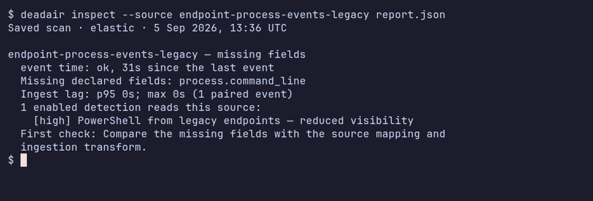

<p align="center">
  <picture>
    <source media="(prefers-color-scheme: dark)" srcset="docs/assets/banner-dark.svg">
    
  </picture>
</p>

<p align="center">
  <a href="https://github.com/alephnull-sh/deadair/actions/workflows/ci.yml"></a>
  <a href="https://github.com/alephnull-sh/deadair/releases"></a>
  
  <a href="LICENSE"></a>
</p>

<p align="center">
  <strong>Open-source SIEM detection health.</strong><br>
  Find enabled detections that are blind because their telemetry is missing, stale, late, or
  schema-incompatible.
</p>

<p align="center">
  Runs locally · Read-only · No agent · No telemetry upload
</p>

<p align="center">
  <a href="https://alephnull-sh.github.io/deadair/">Read the technical write-up</a> ·
  <a href="https://www.detectionengineering.net/i/208193682/detection-engineering-gem">Featured in Detection Engineering Weekly</a> ·
  <a href="https://tldrsec.com/p/tldr-sec-341">Featured in tl;dr sec #341</a>
</p>

<p align="center">
  
</p>

<p align="center">
  <sub>Real scan of a disposable Elastic lab with deliberately missing, stale, late, and unused telemetry. Reproduce it with <code>make record-scan-lab</code>.</sub>
</p>

## Why deadair

A rule can be enabled, scheduled, and error-free while the data it needs is gone. deadair reads the
live rule inventory, resolves each rule's inputs using the backend's native semantics, and checks the
concrete sources behind them.

It catches:

- rules whose index, alias, or data-stream selectors resolve to nothing;
- mixed-selector rules where one declared input has disappeared while another still resolves;
- rules whose matching sources are all stale or empty;
- on Elastic, rules running with missing declared fields or an ingest-lag blind window;
- healthy telemetry that no enabled detection reads.

deadair currently works with Elastic Security and OpenSearch Security Analytics.
OpenSearch does not expose the rule metadata needed for the required-field or ingest-lag checks, so
reports mark those checks unavailable instead of guessing.

## Quick start

Download a binary for macOS, Linux, or Windows from
[GitHub Releases](https://github.com/alephnull-sh/deadair/releases), or install with Go:

```sh
go install github.com/alephnull-sh/deadair/cmd/deadair@latest
```

Connect a read-only SIEM credential:

```sh
deadair setup elastic   # print the least-privilege setup
deadair check           # verify the credential can scan
deadair scan            # assess live rules and telemetry
```

Exit codes are stable: `0` passes the configured gate, `1` means gated findings, and `2` means the scan failed.

## How it works

| Stage | What deadair does |
|---|---|
| Inventory | reads enabled detections and the inputs they declare |
| Resolve | asks Elastic or OpenSearch to resolve index patterns, aliases, data streams, selectors, and remote inputs; direct ES\|QL `FROM` is supported |
| Measure | checks document count, freshest event, storage, and schema history; Elastic also checks declared fields and paired recent-event ingest lag |
| Report | emits terminal, JSON, HTML, fleet rollups, and Prometheus metrics with the evidence behind each verdict |

deadair proves whether a detection's observable telemetry prerequisites are present and healthy. It
does not prove that the rule logic is correct or that a simulated attack will produce an alert. Pair
it with static rule validation and end-to-end detection testing for those layers.

## Findings

| Finding | Meaning | First check |
|---|---|---|
| no matching source | none of the rule's inputs resolve to a visible index or data stream | pattern changes, missing integrations, and credential scope |
| all sources stale or empty | every resolved source is unusable right now | source cadence and the ingest path |
| missing fields | a declared field is absent or non-searchable in one or more resolved sources after every source mapping was read | parser, package, and mapping changes |
| lag blind window | paired-event p95 ingest lag exceeds the rule's lookback margin | rule interval, lookback, timestamp override, and pipeline delay |
| partial input coverage | the complete expression resolves, but one positive selector within it resolves empty | migrations, fallback selectors, and expected alternatives; informational unless policy gates it |
| source degradation | a source is stale, empty, low-volume, or schema-drifted | source history and expected maintenance |
| unused telemetry | data is being stored but no enabled local detection resolves to it | disabled rules and intentional collection |

Every verdict is limited to what the configured credential can see. JSON reports include the
configured expressions, resolved sources, resolution method, assessment status, backend metadata,
and capability evidence. See the [usage guide](docs/usage.md) for worked examples and triage.

## Connect a SIEM

Elastic:

```sh
export DEADAIR_ES_URL=https://es.example.internal:9200
export DEADAIR_KIBANA_URL=https://kibana.example.internal:5601
export DEADAIR_API_KEY=<read-only-api-key>

deadair check
deadair scan --json-out report.json --html-out report.html
```

OpenSearch:

```sh
export DEADAIR_BACKEND=opensearch
export DEADAIR_OPENSEARCH_URL=https://opensearch.example.internal:9200
export DEADAIR_OPENSEARCH_USERNAME=deadair
export DEADAIR_OPENSEARCH_PASSWORD=<password>

deadair check
deadair scan
```

Use the documented least-privilege roles for
[Elastic](docs/credentials/elastic.md) or [OpenSearch](docs/credentials/opensearch.md). The trusted
integration suite also proves that write attempts made with those credentials are rejected.

## CI, fleets, and monitoring

```sh
# Gate a candidate rule against live source availability.
deadair scan --rule new-rule.json

# Fail only on new regressions between reports.
deadair diff yesterday.json today.json

# Scan multiple SIEM instances from one process.
deadair scan --fleet fleet.json

# Export cached scan results as Prometheus metrics.
deadair serve --interval 5m
```

`scan --rule` isolates a backend-native candidate rule or detector from unrelated backlog. `diff`
works with redacted reports created with the same caller-held key. Fleet configuration references
secrets through environment variables rather than storing secret values.

The [official GitHub Action](docs/usage.md#gate-detection-changes) writes a job summary, uploads a
redacted JSON report, and can apply a deadair policy without installing a rule.

<p align="center">
  
</p>

<p align="center">
  <sub>A candidate-rule gate and report diff against a throwaway Elastic stack.</sub>
</p>

See [CI gate behavior](docs/usage.md#gate-detection-changes),
[fleet and MSSP deployment](docs/mssp.md), and the [Prometheus examples](contrib/) for configurations
to test in your own environment.

## Tested backends

The integration workflow currently tests these exact versions:

| Backend | Exact live-CI versions |
|---|---|
| Elastic Security | 8.19.19, 9.4.4 |
| OpenSearch Security Analytics | 2.19.6, 3.7.0 |

Other versions may work but are not covered by the current CI matrix.

## Security model

- All backend access is read-only; trusted integration tests prove the documented credentials cannot write.
- Reports, HTML, state files, and fleet output are written `0600` on POSIX systems.
- Credentials can come from environment variables or files, avoiding secrets in process arguments.
- `--redact` replaces tenant, rule, source, pattern, and field names with keyed HMAC pseudonyms. A
  `--redact-key-file` generated from random bytes also enables redaction and keeps names stable
  across separate runs.
- The exporter binds to loopback by default.
- deadair has no phone-home behavior or usage telemetry.

Treat reports as sensitive SOC artifacts: they identify blind detections, source names, schema gaps,
and unused collection.

## Documentation

- [Usage guide](docs/usage.md) — first scans, report evidence, findings, CI gates, state, and fleets
- [Validation status](docs/validation.md) — tested paths and current limits
- [Architecture](docs/architecture.md) — backend contract, data model, safety properties, and limits
- [Best practices](docs/best-practices.md) — rollout order, alert context, and routing
- [MSSP guide](docs/mssp.md) — secrets, redaction, scheduling, and tenant failure handling
- [Detections that run but can't see](https://alephnull-sh.github.io/deadair/) — the problem and a reproducible simulation

## Contributing

Bug reports, sanitized fixtures, correctness cases, docs, and backend proposals are welcome. Start
with [CONTRIBUTING.md](CONTRIBUTING.md) and use the backend RFC template for adapter work.

## License

Apache-2.0.
