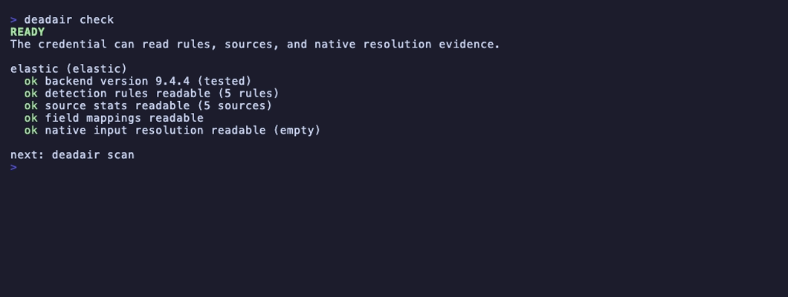

# Usage guide

Start here for first scans, triage, CI gates, stateful checks, fleet scans, exporter mode, and safe
report sharing. For credentials, run `deadair setup <backend>` or open the guide for
[Elastic](credentials/elastic.md), [OpenSearch](credentials/opensearch.md), or
[Microsoft Sentinel](credentials/sentinel.md).

## First scan

Start with a manual scan. Do not wire alerts before a detection engineer has read the first
report.

Choose one setup command for your SIEM:

```sh
deadair setup elastic
deadair setup opensearch
deadair setup sentinel
```

Then verify the credential and scan:

```sh
deadair check
deadair scan
```

`setup` prints the documented read-only role and credential commands for the selected backend.
`check` verifies the connection, required privileges, and optional capabilities such as schema
visibility. `scan` prints the terminal report.



The screenshot above is captured from the same disposable Elastic lab as the README scan with
`make record-scan-lab`.

Common output formats:

```sh
deadair scan --json
deadair scan --json-out report.json
deadair scan --json-out report.json --html-out report.html
```

Exit codes:

| Code | Meaning |
|---:|---|
| `0` | scan completed with no findings that affect the configured gate |
| `1` | scan completed with one or more findings selected by the configured gate |
| `2` | scan failed or the fleet scan was incomplete |

Useful connection flags:

| Flag | Use |
|---|---|
| `--ca-cert ca.pem` | trust a private CA |
| `--insecure-skip-verify` | lab use only; skip TLS verification |
| `--kibana-space soc` | read Elastic rules from a non-default Kibana space |
| `--timeout 90s` | raise the per-scan timeout |

### Microsoft Sentinel

deadair authenticates through `DefaultAzureCredential`. Identify the Log Analytics workspace by its
ARM coordinates:

```sh
az login --tenant <tenant-id>
az account set --subscription <subscription-id>

export DEADAIR_BACKEND=sentinel
export DEADAIR_AZURE_SUBSCRIPTION_ID=<subscription-id>
export DEADAIR_AZURE_RESOURCE_GROUP=<resource-group>
export DEADAIR_SENTINEL_WORKSPACE=<workspace-resource-name>

deadair check
deadair scan --json-out sentinel-report.json
```

The disposable demo intentionally includes broken data paths. Its scan should print `GATE FAILED`
and exit `1`, meaning the scan completed and the configured gate found the seeded problems. Exit
`2` means the scan itself could not complete.

`DEADAIR_SENTINEL_WORKSPACE_ID` can override the discovered Log Analytics customer ID, but deadair
still verifies it against the workspace returned by ARM. Workload identity, managed identity, and
service-principal authentication use the same scan variables. See the
[Sentinel credential guide](credentials/sentinel.md) for role options, the custom reader used in
the live lab, and the API calls.

#### What a Sentinel scan assesses

Sentinel scans cover enabled Scheduled and NRT rules. deadair parses KQL dependencies, then asks
Sentinel and Log Analytics for evidence instead of executing the rule's full query.

| Dependency or check | Evidence boundary |
|---|---|
| local tables, joins, unions, and `let` aliases | ARM table catalog plus bounded Logs queries |
| saved workspace functions | expanded when arguments and defaults are closed scalar values |
| workspace-defined ASIM functions | expanded like other saved functions |
| recognized native ASIM parsers missing from workspace metadata | assessed only when a bounded literal call returns concrete local tables with complete permission and data-source evidence |
| literal `_GetWatchlist('alias')` | watchlist inventory plus a bounded zero-row query; retained as non-monitorable `dependency_evidence` |
| literal `workspace()` table references | assessed only for explicitly mapped workspaces, as described below |
| table freshness | `TimeGenerated` for Scheduled-only Analytics sources; `ingestion_time()` for NRT-only sources |
| filtered source activity | advisory check only when deadair proves one direct local Analytics table followed by a closed literal filter |
| ingest lag | paired event-time and ingestion-time evidence for eligible Scheduled rules |
| summary pipeline runtime | advisory evidence from the latest completed run in a bounded seven-day `LASummaryLogs` query for relevant active summary rules, capped at 50 rules per scan |

An HTTP `200` with `PartialError` is not a successful probe. Dynamic watchlist aliases, tabular
function parameters, row-derived or dynamic arguments, parameter-driven `table()`, dynamic table
selection, external data, and `app()`, `resource()`, ADX/cluster, and ARG references remain
unassessed.

Every join leg and ordinary union leg is required. A missing leg inside an explicit
`union isfuzzy=true` produces partial input coverage instead of making the whole rule unusable.
Native ASIM calls create source edges only for concrete local tables named by the Logs response and
present in the ARM catalog.

A source used by both Scheduled and NRT rules stays incomplete rather than being measured with the
wrong freshness clock. Basic and Auxiliary tables are incompatible with this analytics-rule
evidence path. Sentinel does not expose authoritative rule-required fields or a bounded,
authoritative per-table event and storage inventory, so required-field and unused-telemetry
findings are unavailable. The CLI currently targets Azure public cloud endpoints.

Filtered source activity catches a gap that table-wide freshness cannot: one vendor, device, or
operation can disappear while the shared table still looks healthy. The disposable lab exercised
this path with current FortiGate data beside a stale Palo Alto Networks/PAN-OS slice. deadair runs
the advisory check only when a
query starts at one direct local table and immediately applies a closed,
parser-supported literal filter. Remote, joined, unioned, dynamic, escaped-literal, and
function-backed sources do not qualify. The result appears in `rule_source_freshness`; it does not
replace table health or create findings. One scan runs at most 20 of these queries.

Watchlists do not receive freshness, lag, schema, storage, or source-health verdicts. Their
resolution is still part of the rule assessment: a missing required watchlist can make a rule
disconnected, while an unavailable check remains unassessed. `dependency_evidence` records why.

#### Cross-workspace rules

To assess direct literal `workspace()` references, create a restricted JSON allowlist:

```json
[
  {
    "alias": "soc",
    "azure_subscription_id": "<subscription-id>",
    "azure_resource_group": "<resource-group>",
    "sentinel_workspace": "<workspace-resource-name>",
    "sentinel_workspace_id": "<optional-customer-guid>"
  }
]
```

`alias`, subscription, resource group, and workspace name are required. The customer ID is optional
and is still verified through ARM. Pass the file with `--sentinel-remotes FILE` or
`DEADAIR_SENTINEL_REMOTES`. A target matches only an explicitly configured alias, a verified
customer GUID, or the canonical ARM workspace ID. In a fleet file, put these objects in
`sentinel_remote_workspaces` on the Sentinel instance instead of using `--sentinel-remotes`.

Textual aliases need a remote table-catalog read and a bounded zero-row query using the rule's
original literal. The response must tie permission and data-source evidence to the configured
workspace. GUID and canonical ARM-ID mappings do not need this alias-identity proof. The home and
remote workspaces use the same `DefaultAzureCredential` identity; there are no per-remote
credentials.

Microsoft requires Sentinel to be deployed on every workspace referenced by a cross-workspace
analytics rule. Before reading a configured remote table catalog or running a Logs probe, deadair
requires the remote workspace to return the exact `onboardingStates/default` resource. A missing,
denied, malformed, or mismatched onboarding response makes the input `unavailable`; it is not an
absent-table result, and no table or Logs probe follows.

Once a remote is verified, its source identity uses the canonical ARM workspace ID. Local and remote
tables with the same name therefore remain distinct. An unmapped target stays `remote`; an unreadable
or not-provably-onboarded target is `unavailable`; only a table missing from a verified, onboarded
remote catalog is `empty`.

`deadair check` tests onboarding, metadata, and query access for configured remotes referenced by
enabled rules. A required remote that cannot prove onboarding or read access blocks readiness. An
unused mapping is not evidence that `check` touched that workspace. `scan` and candidate scans keep
onboarding failures as unavailable evidence rather than continuing to freshness probes.

#### Cross-workspace limits

Two separate Microsoft limits apply:

| Scope | Platform limit | deadair behavior |
|---|---|---|
| workspaces in an analytics-rule query | 20; Microsoft recommends no more than five for performance | counts the home workspace plus distinct verified remotes; more than 20 is `incompatible` |
| Azure regions in the Logs query scope | blocked at 20 or more; warning at five | counts the home region plus verified remote regions; 20 or more is `incompatible`; missing location evidence is `unavailable` |

The five-workspace recommendation and five-region warning are platform guidance, not deadair
findings. Textual aliases must pass their catalog and identity proof before either count is
conclusive. See Microsoft's
[cross-workspace analytics-rule limits](https://learn.microsoft.com/en-us/azure/sentinel/extend-sentinel-across-workspaces-tenants#include-cross-workspace-queries-in-scheduled-analytics-rules)
and [Log Analytics query-scope limits](https://learn.microsoft.com/en-us/azure/azure-monitor/logs/scope#query-scope-limits).

For mappings within the rule's subscription, positive ARM and Logs evidence can conclusively prove
source availability under the scanner identity. That does not extend to execution identity across
subscriptions or tenants. Microsoft applies the rule creator's credentials to those analytics
rules, so a scanner-positive query can coexist with a rule that stopped running after its creator
lost access. For an eligible installed rule that references another subscription, deadair accepts
only an exact, successful `SentinelHealth` record matching that rule identity, recorded after the
latest rule change and within the rule's expected run cadence plus Microsoft's scheduling delay.
It does not generalize that evidence to another rule or workspace. Candidate rules and absent,
old, ambiguous, mismatched, or non-successful health records remain unassessed.
deadair does not separately identify tenant boundaries; Azure Lighthouse and other cross-tenant
topologies have not been live-validated. See Microsoft's
[analytics-rule access model](https://learn.microsoft.com/en-us/azure/sentinel/threat-detection#access-permissions-for-analytics-rules)
and [failure guidance](https://learn.microsoft.com/en-us/azure/sentinel/troubleshoot-analytics-rules#permanent-failure-due-to-lost-access-across-subscriptionstenants).

These runtime tables are opt-in. `_SentinelHealth()` requires Sentinel auditing and health
monitoring. `LASummaryLogs` requires the Summary Logs diagnostic setting and appears only after a
summary event is emitted. Missing runtime evidence does not create a finding. With table-level RBAC,
the custom role also needs
`Microsoft.OperationalInsights/workspaces/query/SentinelHealth/read` and
`Microsoft.OperationalInsights/workspaces/query/LASummaryLogs/read`, or the broader
`Microsoft.OperationalInsights/workspaces/query/*/read` action.

## Read the findings

A finding states what deadair observed. It does not guess the root cause. Start with the rule,
inspect the evidence behind its verdict, then decide whether the condition is expected coverage
scope, a regression, or incomplete visibility for the deadair credential.

Terms used in reports:

| Term | Meaning |
|---|---|
| rule input | backend expression configured on the detection, such as an index selector, data view, or KQL table dependency |
| source | concrete index, data stream, or Sentinel table visible to deadair, such as `winlogbeat-2026.07` or `SigninLogs` |
| resolved source | concrete source returned by the backend's native input-resolution API |
| dead detection | enabled rule with no usable source, or with only stale/empty matched sources |
| impaired detection | enabled rule with live input but positive evidence of reduced field, timing, or source coverage |
| partial input coverage | the complete input resolves, but one positive selector inside a multi-selector expression resolves empty |

The source inventory is credential-scoped. deadair records whether each input was `resolved`,
`empty`, `incompatible`, `unsupported`, `unavailable`, `remote`, or `ambiguous`. `Incompatible`
means the source was identified but its configuration cannot be used by that rule type. Permission
failures and unsupported query types stay visible as unassessed inputs; they are never silently
treated as healthy or dead.

For a rule with several positive selectors, deadair also resolves each selector with the rule's
exclusions retained. If the complete expression resolves but one selector does not, the report
records partial input coverage. This is useful during source migrations, but it is not a dead-rule
verdict: selectors may be alternatives or fallbacks. It affects exit status only when a policy
includes the `partial-input` finding class.

### No matching source

Human reports say `no matching source`; JSON uses the stable reason code `disconnected`. It means
the backend understood the enabled rule's input and positively resolved it to no concrete index,
alias target, data stream, or Sentinel table visible to the credential.

It does not mean the SIEM, agent, or network connection is disconnected. A connection or
authentication failure makes the scan or fleet instance fail and returns exit `2`; it is not a rule
verdict.

A finding from the checked-in lab report:

| Evidence | Value |
|---|---|
| Rule | `Sysmon registry run-key modification` |
| Configured patterns | `winlogbeat-sysmon-*` |
| Matched sources | none |
| Impact | the rule currently has no source to query |
| Lab explanation | the disposable lab intentionally does not create a matching Sysmon source |

That is an expected coverage gap in the lab. A production regression looks similar but has a change
behind it: a Windows rule still queries `winlogbeat-*`, telemetry moves to
`logs-windows.sysmon_operational-*`, and the old Winlogbeat indices age out. The rule remains enabled,
but its configured input no longer names the source carrying the events.

Common explanations:

| Situation | What to verify |
|---|---|
| integration not onboarded | whether the rule is intentionally enabled before its data source is available |
| source renamed or migrated | current data-stream names after an agent, package, or pipeline change |
| rule copied from another tenant | whether that tenant has the same integrations and naming conventions |
| pattern typo or stale override | the rule's configured index patterns or data view |
| credential cannot see the source | index permissions and Kibana space for the deadair credential |

First response:

1. Read `dead_detections[].patterns` and the rule's `input_resolutions` evidence in the JSON report.
2. Confirm whether the native resolver returned the expected alias, data stream, concrete index, or
   Sentinel table.
3. Confirm the deadair credential can resolve and read that source.
4. Classify the finding as expected scope, onboarding work, or regression.
5. Update the rule pattern, restore the integration, or disable the intentionally out-of-scope rule.

```sh
deadair scan --json --json-out report.json
jq '.dead_detections[] | select(.reason == "disconnected") | {name, patterns}' report.json
```

### All matching sources stale or empty

Human reports spell this out; JSON uses `starved`. The rule patterns resolve correctly, but every
matched source is degraded. A source is `stale` when it has documents but no recent event inside
`--max-stale`; it is `empty` when it exists with zero documents. Timestamps up to five minutes
ahead are accepted for ordinary clock skew. A timestamp farther in the future is treated as stale
because it cannot establish current source freshness. Its JSON source age is marked unavailable,
and the exporter omits the exact-age gauge for that source.

For example, a rule queries `logs-system.auth-*` and resolves to
`logs-system.auth-default`, but the newest event is three days old. The pattern is not the problem.
The ingest path stopped, the source is intentionally quiet, or the stale threshold does not match
its cadence.

Inspect `dead_detections[].sources`, then find those names under `sources[]` for document count,
age, status, and consumer count. Check the agent or connector, forwarder, ingest pipeline, upstream
system, expected cadence, and downtime configuration.

### Incompatible source configuration

JSON uses `source-plan-incompatible` when a rule's known sources cannot be queried under their
current configuration. If every input is incompatible, the rule is dead. If another input remains
usable, the rule is impaired and `incompatible_sources` names the lost coverage. Change the source
configuration or move the affected query to a rule type that supports it.

### Impaired detections

Impaired rules still have live input. deadair has evidence that part of their effective coverage is
reduced.

| Finding | Evidence | Example | First response |
|---|---|---|---|
| `missing-fields` | a best-effort rule-declared field is absent or non-searchable in at least one concrete matched source, with complete `field_caps` evidence for every matched source | a parser upgrade stops mapping `process.command_line` while a rule declares it as required | compare rule metadata, package version, pipeline, and mapping |
| `lag-blind-window` | paired-event p95 ingest lag exceeds the rule's lookback-minus-interval margin | cloud audit events arrive 12 minutes late while a five-minute rule looks back six minutes | reduce delivery lag, widen lookback, or use the appropriate ingest timestamp |
| `source-plan-incompatible` | a known source configuration cannot be queried by this rule type while another input remains usable | one table moves to a plan that scheduled analytics rules cannot query | change the source plan or split the query into a supported rule path |

`required_fields` is informational metadata, and `field_caps` proves mapping/searchability rather
than field population in recent events. deadair records present, missing, and incomplete evidence
per concrete source and does not make a rule-level claim when any matched-source mapping read fails.
Treat `missing-fields` as strong triage evidence, not proof that every event is missing the value.
Sentinel does not expose authoritative rule-required fields, so this check is unavailable there. Lag
findings are also a timing model; validate them against the source's real delivery behavior and the
rule type.

### Source findings

| Finding | What deadair observed | First response |
|---|---|---|
| `stale` | source has documents but no recent event inside `--max-stale` | compare expected cadence, then check collector, connector, forwarder, and pipeline health |
| `empty` | source exists with zero documents | finish onboarding, fix routing, or remove an unused template/source |
| `unknown` | freshness could not be measured | check `@timestamp` mapping and read privileges; unknown does not make rules dead |
| `maintenance` | a downtime window currently suppresses stale/empty classification | confirm the declared window still matches the operating schedule |
| low volume | source is below its own weekday/hour baseline after warmup and hysteresis | compare known business cycles and upstream volume before paging |
| schema drift | fields were added, removed, or changed type since the prior snapshot | correlate with package, parser, and pipeline releases |
| unused telemetry | source has data and every enabled local input was assessed, but none resolves to it | confirm intentional collection, disabled rules, and planned coverage before changing ingest |

`remote_rules` contains cross-cluster patterns such as `cluster:index-*` and Sentinel remote inputs
that were not explicitly mapped or cannot be assessed. A verified, mapped `workspace()` table is a
qualified resolved source instead. `unmapped_rules` retains unsupported, unavailable, and ambiguous
input assessments, including query types deadair cannot safely interpret yet. These are
informational because deadair does not turn uncertainty into a finding.

If an enabled local input is unsupported, unavailable, or ambiguous, unused telemetry is marked
`unavailable` and withheld rather than turning incomplete coverage into a cost finding. Candidate
reports mark it `not-applicable`. Sentinel also withholds unused telemetry because its workspace
table inventory does not provide the bounded, authoritative per-table event and storage evidence
required by that finding.

The full source evidence is in `input_resolutions`. Each record includes the declared selector or
ordered expression, status, resolution method, observation time, logical aliases, and resolved
sources. Sentinel reports can also include:

- `dependency_evidence` for literal watchlists, native ASIM probes, and other prerequisites that do
  not necessarily become source-health edges;
- `source_lineage` for the ARM-described path from a summary-rule input through its transform to an
  Analytics destination table consumed by an enabled detection;
- `rule_source_freshness` for an eligible rule's bounded, predicate-qualified local table slice;
- `summary_rule_runs` for the latest bounded completed `LASummaryLogs` run associated with a relevant
  summary rule; and
- `rule_provenance` for exact native template and Content Hub template/package IDs and versions.

`dependency_evidence` explains dependency-resolution outcomes. A required dependency can affect the
rule verdict through authoritative input resolution. `source_lineage`, `rule_provenance`,
`rule_source_freshness`, and `summary_rule_runs` add context without changing the gate.

Summary lineage records ARM structure. `summary_rule_runs` records the latest completed native run
inside its bounded window. In-progress rows do not replace the last completed run, and an overdue
success is retained as incomplete evidence. The [validation record](validation.md#sentinel-live-conformance)
describes the live filtered-source and summary-runtime cases.

`--include` and `--exclude` do not change detection verdicts. They do scope source-level reporting
and source-level findings such as degraded, low-volume, schema-drifted, or unused sources, so a
policy that gates those classes can produce a different exit result.

## Gate detection changes

Use `scan --rule` in detection-as-code pull requests:

```sh
deadair scan --rule candidate-rule.json
```

For Elastic, the candidate can be one rule object, an array, or an ndjson rule export. For
OpenSearch, pass a Security Analytics detector create/update object, get response, search hit, or an
array of those objects. Sentinel accepts a direct Scheduled or NRT ARM JSON body, one Azure-Sentinel
analytic-rule YAML document, or an ARM deployment template containing alert-rule resources whose
name, query, and timing resolve from literals, parameter defaults, or simple variables. Compiled
Bicep JSON works within those limits. Raw Bicep, ARM parameter-only documents, and alert-rule
templates are rejected.

deadair evaluates the candidate against the live environment without installing it. Sentinel
candidates are treated as enabled for the gate, and `requiredDataConnectors` metadata does not create
table dependencies; the KQL query is the evidence source. deadair does not execute the candidate's
full KQL. It runs only the same bounded table and dependency probes used for installed rules.
Summary-lineage and Content Hub enrichment are skipped for candidates. Exit `1` means
the candidate is dead or impaired; exit `2` means its inputs were unsupported, unavailable,
ambiguous, remote, or otherwise not safely assessed. Existing source-health findings do not block
the candidate gate. A fleet candidate scan must use one backend because the accepted candidate
formats differ by backend.

The official GitHub Action wraps single-instance candidate gates for Elastic, OpenSearch, and
Sentinel. It keeps the JSON evidence as a workflow artifact and writes the useful counts to the job
summary. For Elastic or OpenSearch, pass the connection details through repository or environment
secrets:

```yaml
permissions:
  contents: read

steps:
  - name: Check out detection rules
    uses: actions/checkout@3d3c42e5aac5ba805825da76410c181273ba90b1 # v7
    with:
      persist-credentials: false
  - name: Check candidate coverage
    uses: alephnull-sh/deadair@v0.7.0
    with:
      backend: elastic
      elasticsearch-url: ${{ secrets.DEADAIR_ES_URL }}
      kibana-url: ${{ secrets.DEADAIR_KIBANA_URL }}
      api-key: ${{ secrets.DEADAIR_API_KEY }}
      candidate-rule: detections/new-rule.json
      policy-file: deadair-policy.json
```

For Sentinel, authenticate the runner before invoking deadair. The recommended GitHub-hosted path
uses Azure OIDC: `azure/login` exchanges the GitHub token and creates an Azure CLI session, then
deadair's `DefaultAzureCredential` reuses that session through `AzureCLICredential`. The deadair
Action defines no Azure credential inputs and does not call `azure/login` itself.

```yaml
permissions:
  contents: read
  id-token: write

jobs:
  sentinel-gate:
    runs-on: ubuntu-latest
    environment: sentinel-read

    steps:
      - name: Check out detection rules
        uses: actions/checkout@3d3c42e5aac5ba805825da76410c181273ba90b1 # v7
        with:
          persist-credentials: false
      - name: Sign in to Azure with OIDC
        uses: azure/login@532459ea530d8321f2fb9bb10d1e0bcf23869a43 # v3.0.0
        with:
          client-id: ${{ vars.AZURE_CLIENT_ID }}
          tenant-id: ${{ vars.AZURE_TENANT_ID }}
          subscription-id: ${{ vars.AZURE_SUBSCRIPTION_ID }}
      - name: Check Sentinel candidate coverage
        uses: alephnull-sh/deadair@v0.7.0
        env:
          AZURE_TOKEN_CREDENTIALS: AzureCLICredential
        with:
          backend: sentinel
          azure-subscription-id: ${{ vars.AZURE_SUBSCRIPTION_ID }}
          azure-resource-group: ${{ vars.AZURE_RESOURCE_GROUP }}
          sentinel-workspace: ${{ vars.AZURE_SENTINEL_WORKSPACE }}
          candidate-rule: detections/new-rule.yaml
          policy-file: deadair-policy.json
```

Define the Azure identifiers in the protected `sentinel-read` GitHub Environment, and make the
Entra federated credential's subject match that environment. `id-token: write` lets the job ask
GitHub for an OIDC token; Azure RBAC still decides what the identity can read or write. Give it the
read-only workspace roles from the [Sentinel credential guide](credentials/sentinel.md), leave
Azure Login's cleanup enabled, and run only trusted, pinned actions after the login step. An Azure
CLI login is shared by later steps in the same job. The disposable lab used a certificate-backed
`EnvironmentCredential`; the hosted OIDC path is covered by Action wrapper tests, not a live Azure
run.

`sentinel-workspace-id` can supply the optional Log Analytics customer-ID override, and
`sentinel-remotes-file` can point to the explicit JSON mapping used by cross-workspace rules. The
Action still verifies the customer ID through ARM and applies the same remote-evidence limits as the
CLI. This path targets Azure public cloud; Azure Login settings for another cloud do not change
deadair's endpoints.

Treat the remote mapping as part of the scanner's authority boundary. It decides which workspace
aliases deadair may resolve and query with the job's Azure identity. Do not read it from an
untrusted pull-request checkout. Load it from a protected base branch or restricted runner path, or
require CODEOWNERS review for changes.

The Action always fails on a scan error. Findings also fail the step unless
`fail-on-findings: "false"` is set, which is useful while establishing a baseline. Reports are
redacted before upload by default. Set `redact-key-file` to a secret file when redacted names must
remain stable across runs; setting `redact-report: "false"` can expose sensitive blind-spot evidence
in the job log and artifact. Redaction covers terminal and JSON output, not a `--state-file`; state
files remain raw and sensitive.

If the Action runs more than once in a job or across a matrix, give each upload a unique
`artifact-name`, such as `deadair-report-${{ strategy.job-index }}`.

The policy is part of the gate. Do not let a pull request weaken the policy that evaluates it. Read
the policy from a protected base branch or restricted runner path, or require CODEOWNERS review for
policy changes.

The Action does not emit SARIF because live operational findings do not map to source-file
locations. It accepts one SIEM instance and rejects `--fleet`; use the CLI directly for fleet
files.

A local policy can set source-specific freshness, choose which finding classes gate, and accept a
known finding until a fixed expiry:

```json
{
  "version": 1,
  "severity_threshold": "high",
  "gate_classes": ["dead-detection", "impaired-detection", "source-degraded"],
  "sources": [{"pattern": "logs-cloudtrail-*", "max_stale": "2h"}],
  "accepted": [{
    "finding_id": "finding-0123456789abcdef0123",
    "reason": "source migration",
    "expires_at": "2035-01-15T00:00:00Z"
  }]
}
```

The expiry in this example is illustrative; choose a short, reviewed exception window. Run it with
`deadair scan --policy deadair-policy.json`. Copy acceptance IDs from a restricted, unredacted
report. Policy matching happens before optional report redaction, which replaces finding
IDs along with the other identifiers. An expired acceptance remains visible as `expired`, stops
suppressing its finding, and gates normally. Source entries use the first matching pattern. The
severity threshold applies to rule findings; source findings are controlled by their class.
Malformed policy files fail the scan.

A policy can name source patterns, accepted finding IDs, and the reason an exception exists. Check
one in only when repository access matches the sensitivity of that information. For a public
repository, keep sensitive entries in a restricted file created on the runner and pass that path to
`policy-file`.

Use `diff` for scheduled checks while the backlog is still being worked down:

```sh
deadair scan --json --json-out today.json
deadair diff yesterday.json today.json
```

`diff` first checks schema, backend, instance, target, redaction key, source filters, candidate rule
set, and assessment configuration. The normalized Sentinel remote-workspace mapping set contributes
to target and assessment identity, so changing it requires a new baseline. Incomparable reports
exit `2`. Comparable reports diff stable reason-level finding IDs, so one newly missing field does
not make every impairment on that rule look new. Recoveries are shown but do not fail the command.

Reports created before v0.6.0 do not contain the comparison identity fields. After upgrading,
create a new baseline with v0.6.0 or later.

## Add history-based checks

Stateful checks need a local state file:

```sh
deadair scan --state-file deadair-state.json
```

With a state file, deadair records source history for:

- volume baselines by weekday and hour
- warmup before low-volume findings can fire
- hysteresis, so one low scan does not page by itself
- active and recovered finding history

Ingest lag is sampled from paired timestamps during each eligible Elastic or Sentinel Scheduled
scan; it does not depend on the state file. Sentinel NRT rules use ingestion-time freshness and do
not receive the Scheduled-rule lag-window finding.

The default thresholds wait for local history before reporting low volume:

| Flag | Default | Meaning |
|---|---:|---|
| `--volume-warmup` | `24h` | minimum observation time before volume findings can fire |
| `--volume-hysteresis` | `2` | consecutive low scans required |
| `--volume-min-samples` | `4` | same weekday/hour samples required before evaluation |
| `--volume-z-threshold` | `3` | low-volume z-score threshold |

After you have real history, ask deadair for tuning suggestions:

```sh
deadair tune --state-file deadair-state.json
```

## Track schema drift

Schema drift uses `field_caps` snapshots over time:

```sh
deadair scan --state-file deadair-state.json --schema
```

The first scan records a snapshot. Later scans report fields added, removed, or changed in type.
This is useful after agent upgrades, package upgrades, parser changes, and pipeline releases.

Schema drift is source-level evidence. It does not automatically prove a rule is broken. Rule
impairment is reported when a required field is absent or non-searchable in one or more matched
sources and every needed source mapping was read successfully.

## Declare maintenance windows

Use downtime windows for expected source quiet periods. This keeps the source visible, suppresses
the finding during the window, and prevents the quiet period from poisoning volume baselines.

```json
{"windows": [
  {
    "name": "weekly patch window",
    "sources": ["winlogbeat-*"],
    "days": ["sat"],
    "start": "22:00",
    "end": "02:00",
    "timezone": "Europe/London"
  }
]}
```

Run with:

```sh
deadair scan --state-file deadair-state.json --downtime-file downtime.json
```

Prefer downtime windows over exclusions. Exclusions hide sources from the listing, which can hide
real coverage gaps.

## Scan fleets

Use `--fleet` for multiple SIEM instances:

```sh
deadair check --fleet fleet.json
deadair scan --fleet fleet.json
deadair serve --fleet fleet.json
```

Fleet scans are sequential. One failed tenant is recorded as an instance error and the command
exits `2`; successful tenants still appear in the same report. With `--state-file`, deadair writes
one state file per instance. The fleet summary carries `unused_telemetry_assessment`; it is
`unavailable` if any instance failed or could not establish complete local consumer coverage, so a
partial `unused_bytes` total is not presented as a fleet-wide measurement.

Use `check --fleet` after onboarding a tenant or rotating a tenant secret.

For MSSP operating guidance, including secret layout, redaction, Alertmanager routing, and fleet
operations, see [mssp.md](mssp.md).

## Run the exporter

```sh
deadair serve --interval 5m --state-file deadair-state.json
```

Metrics are exposed on `127.0.0.1:9317` by default. Prometheus scrapes the cached last scan; a
scrape does not trigger a SIEM API call. Grafana and Alertmanager examples are in the
[repository's `contrib` directory](https://github.com/alephnull-sh/deadair/tree/main/contrib).

For fleets, route failed scans by `deadair_instance_up`. No-match findings usually go to detection
engineering or onboarding after credential scope is checked. Findings where all matched sources are
stale or empty usually belong to telemetry pipeline owners.

## Share reports safely

Use `--redact` for anything leaving the restricted SOC workspace:

```sh
deadair scan --json --redact --json-out redacted-report.json
deadair serve --redact
deadair tune --state-file deadair-state.json --redact
```

Redaction replaces tenant, source, rule, pattern, field, dependency, lineage, provenance, workspace,
watchlist, template, and package identifiers with HMAC pseudonyms. Validated dependency probe
expressions and their KQL arguments are never serialized. Values use a process-local key by default.
For diffs and trend reporting across separate
runs, generate a random key in a restricted directory and pass it by path:

```sh
umask 077
mkdir -p ~/.config/deadair
openssl rand -hex 32 > ~/.config/deadair/redaction.key
export DEADAIR_REDACT_KEY_FILE="$HOME/.config/deadair/redaction.key"
deadair scan --json-out redacted-report.json
```

The report records a non-secret key identifier so consumers can check whether two reports are
correlatable. It never records the key. Redacted fleet reports also replace raw scan failures,
which may contain hosts or response details, with fixed error categories.

Unredacted reports map blind detections, unused telemetry, workspace relationships, dependency
aliases, data transformations, and installed content. Treat them like sensitive SOC artifacts.
Redaction is not declassification: evidence kinds, statuses, versions, counts, timing, lag, and
coverage information remain visible.
